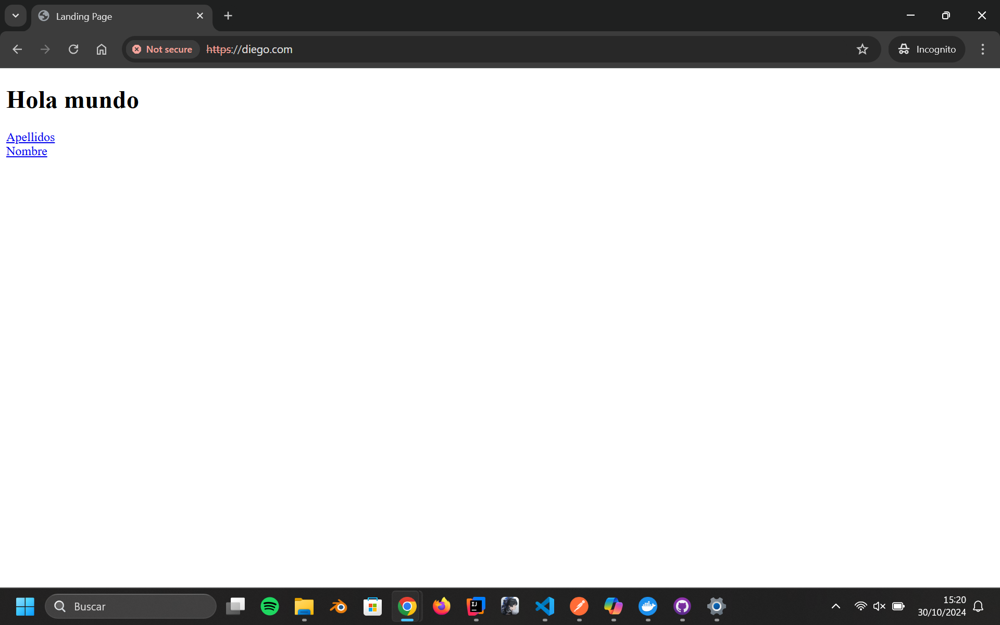
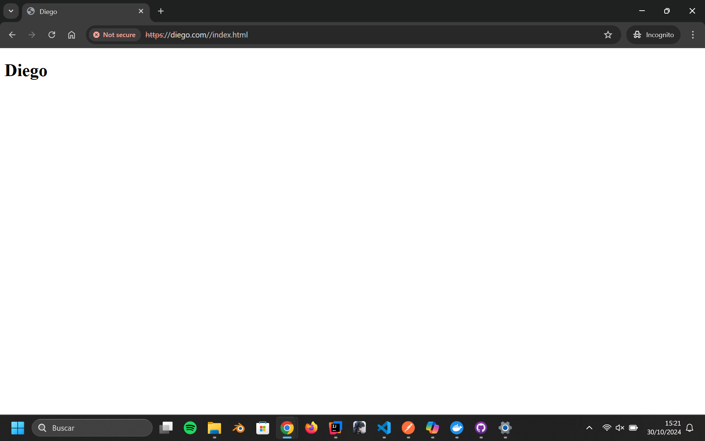
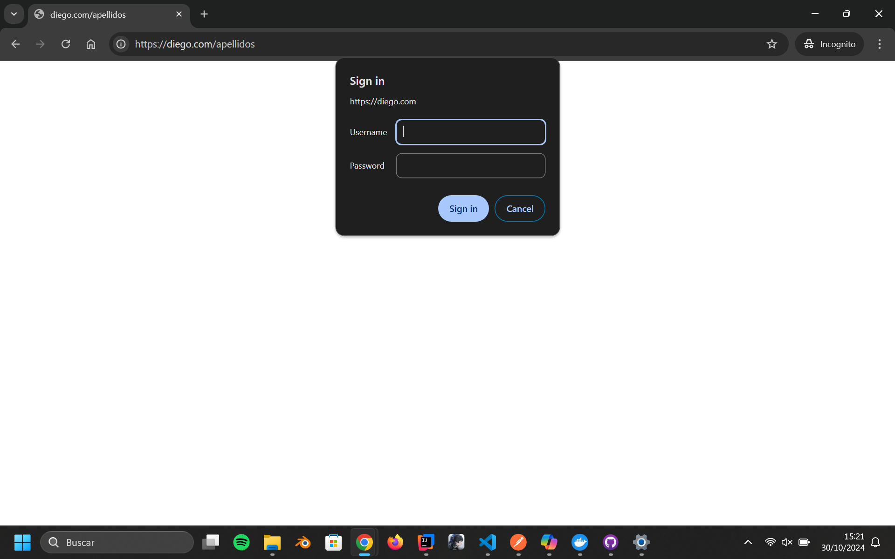
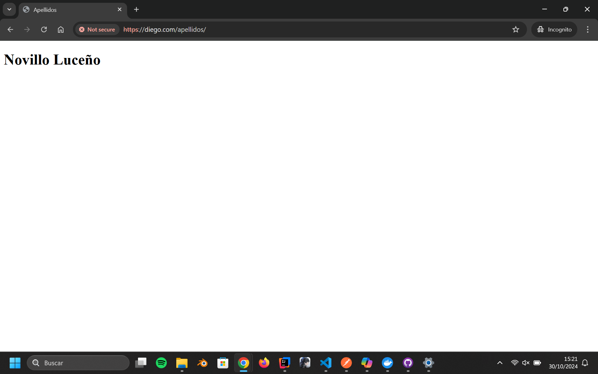

# PracticaProxy

## Explicación

Mi práctica consiste en tres páginas que se ubican en distintos contenedores a los que se accede mediante un reverse proxy realizado en ngynx. La página principal se llama \"diego.com\" y dos subpáginas que son \"/nombre\" y \"/apellidos\".

- La página principal (**diego.com**): consiste en una línea de texto que dice \"Hola mundo\" y contiene dos links que redireccionan a las otras dos páginas.
- La página con el nombre(**diego.com/nombre**): es una página pública que solo contiene una línea de texto con mi nombre.
- La página con el nombre(**diego.com/apellidos**) que está protegida con nombre de usuario y contraseña y contiene una línea con mis apellidos.

La página está despleagada con 3 contenedores en Docker, dos que tienen una imagen de Ngynx, uno de los cuales es el reverse proxy y el otro que contiene la página principal y la página pública de "\nombre\", la otra tiene una imagen de apache con la página \"apellidos".

## Proceso

Para todas las páginas utilizé la página por defecto que viene con apache y ngynx.
Para realizar el reverse proxy cambié la configuración de ngynx para mandar la página al contenedor correspondiente.

Para la página de apache le añadí validación con el fichero \".htpasswd".

## Capturas

### diego.com

 

### diego.com/nombre

 

### diego.com/apellidos

#### Verificación

 

#### Validada

